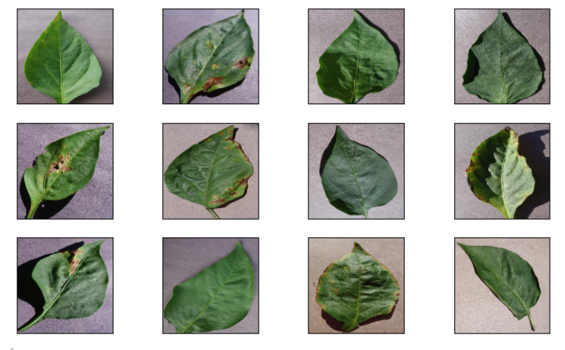

<h1>Monitoring Pepper Health: Image Classification with Deep Learning</h1>

Image classification is the process of assigning classes to images. This is done by finding similar features in images belonging to different classes and using them to identify and label images. 

In this project, I will introduce the artificial intelligence model we developed to classify healthy and unhealthy peppers. This project is an important step in monitoring plant health in agriculture and diagnosing diseased plants early.

In our project, we used the PlantVillage dataset. This dataset contains images of healthy and diseased leaves of various plant species. We focused on pepper images in this dataset.

The PlantVillage dataset contains more than 50,000 plant leaf images in total. These images represent different types of diseases and healthy plants. We trained our model using images of healthy and unhealthy peppers.

Within the scope of this project, we developed an artificial intelligence model that can detect the healthy and unhealthy conditions of pepper plants.

This study demonstrates the potential of artificial intelligence applications in agriculture and constitutes a fundamental step for studies in this field.

